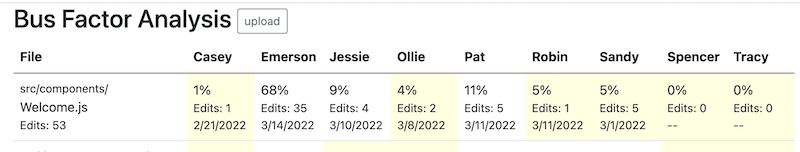
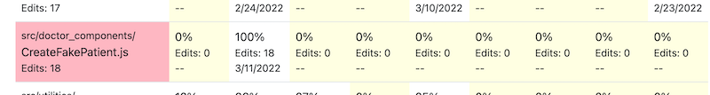

This tool analyzes **git log** output to identify potential team and bus factor issues for small
developer teams. 

# Usage

Run **git log** as follows.
```
git log --no-merges --name-status main > ~/gitlog.txt
```
Put the output file some place easy to find outside your repository.

Upload the output file to https://criesbeck.github.io/busfactor/. Nothing is stored on the server.
If you prefer, download and serve **index.html** locally.

# Output

After uploading, the app displays two tables. 

## Commits

The first table is a summary of commits
per week by each team member since the start of the project. This is comparable to
the **Contributors** section of the **Insight**
page of the repo on Github, except that 
- delete commits are not counted
- the dates are the end of each week, e.g., the column **3/6/2022** would count
the commits for the week ending on March 6, 2022. 

Commits are not a measure of work or value. Some commits are trivial, some are major.
But a team should always be concerned about their processes 
when there are team members with fewer than two commits
in a week.

## Bus factor

The second table displays how often each developer has contributed to each code file. 
Code file means JavaScript, CSS, HTML, or YAML.
Most active files are listed first. Activity is based on number and recency of edits.
The cells of the table show what percentage each developer contributed to the activity on each file.



Developers who have contributed less than 5% to a file are highlighted. 
These developers should be first in line for future work on those files.

Active files with only one or two contributors over 5% are 
bus factor risks and are highlighted. Pay particular attention to bus factor
issues in the top ten or so file. 
Future work on those files should include other team members.



# Customization

Clone this repository. 

To change what files are tracked, edit the regular expressions in  **EDIT_PAT**.

To change the threshold for being an active contributor, change **THRESHOLD**.